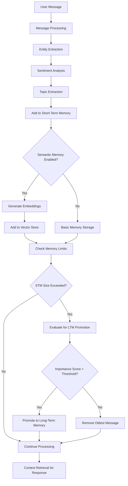
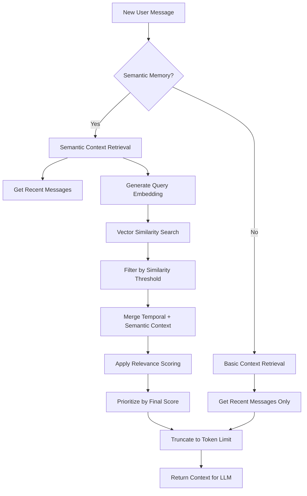
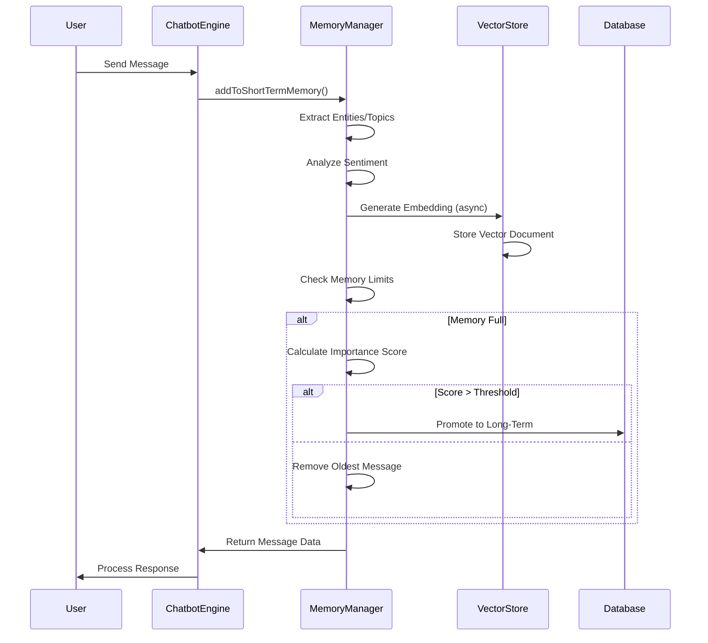
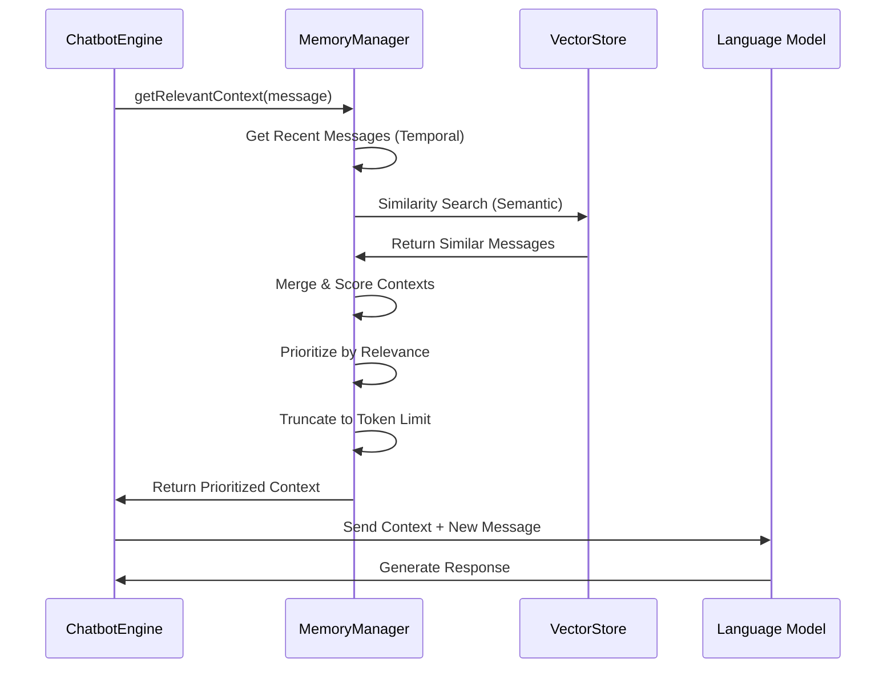
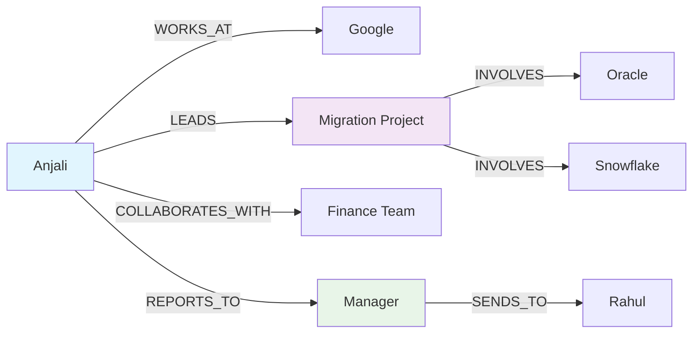
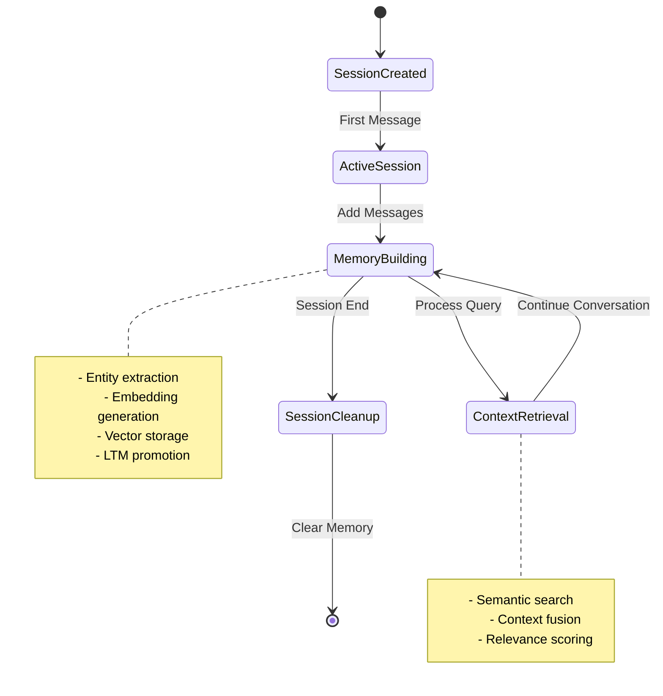
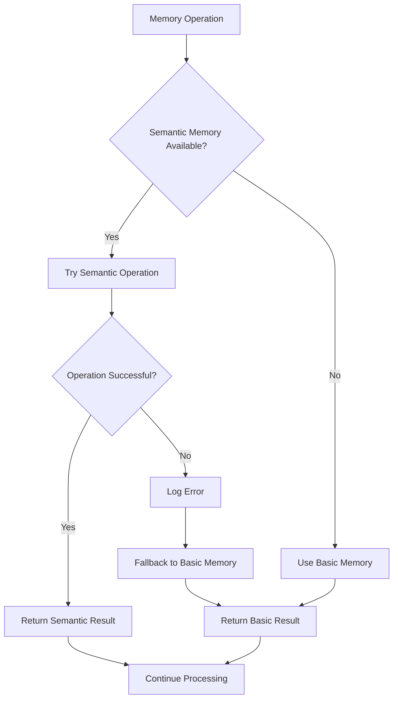

# Memory Management Architecture - Chatbot Playground

## Overview

The Chatbot Playground implements a sophisticated multi-layered memory management system that combines traditional short-term/long-term memory with advanced semantic memory capabilities using vector embeddings and similarity search.

## Architecture Components

### 1. Core Memory Classes

```
MemoryManager (Base Class)
├── Short-term Memory (In-Memory)
├── Long-term Memory (SQLite)
├── Entity Extraction
├── Session Management
└── Memory Analytics

SemanticMemoryManager (Extended Class)
├── Inherits from MemoryManager
├── Vector Store Management
├── Embedding Generation
├── Semantic Similarity Search
├── Context Fusion (Temporal + Semantic)
└── Advanced Entity Relationships
```

### 2. Memory Layers

#### Layer 1: Short-Term Memory (STM)
- **Storage**: In-memory Map structure
- **Capacity**: Configurable (default: 20 messages per session)
- **Scope**: Per-session isolation
- **Lifecycle**: Cleared on session end
- **Purpose**: Immediate conversation context

#### Layer 2: Long-Term Memory (LTM)
- **Storage**: SQLite database
- **Capacity**: Unlimited
- **Scope**: Cross-session persistence
- **Lifecycle**: Permanent storage
- **Purpose**: Important information retention

#### Layer 3: Semantic Memory (Advanced)
- **Storage**: Vector embeddings in MemoryVectorStore
- **Capacity**: Configurable (default: unlimited per session)
- **Scope**: Per-session vector stores
- **Lifecycle**: Cleared on session end
- **Purpose**: Semantic similarity and context retrieval

## Detailed Architecture Flow

### Memory Processing Pipeline



### Context Retrieval Flow



## Memory Manager Implementation

### Base MemoryManager Class

```javascript
class MemoryManager {
  constructor(dbManager) {
    this.shortTermMemory = new Map(); // sessionId -> memory object
    this.dbManager = dbManager;
    this.shortTermMemorySize = 20;
    this.longTermMemoryThreshold = 5;
  }

  // Memory Structure per Session
  createSessionMemory(sessionId) {
    return {
      sessionId,
      messages: [],           // Array of message objects
      entities: new Map(),    // entity_type:value -> metadata
      topics: new Set(),      // Set of extracted topics
      lastActivity: Date.now(),
      createdAt: Date.now()
    };
  }
}
```

### Enhanced SemanticMemoryManager Class

```javascript
class SemanticMemoryManager extends MemoryManager {
  constructor(dbManager, config = {}) {
    super(dbManager);
    this.vectorStores = new Map();     // sessionId -> MemoryVectorStore
    this.embeddings = new OpenAIEmbeddings();
    this.similarityThreshold = 0.75;
    this.semanticWeight = 0.6;
  }

  // Enhanced Message Structure
  createMessageData(message, role) {
    return {
      id: uuidv4(),
      role,
      content: message,
      timestamp: Date.now(),
      entities: this.extractEntities(message),
      sentiment: this.analyzeSentiment(message),
      topics: this.extractTopics(message),
      embedding: null,        // Generated asynchronously
      importance: 0           // Calculated importance score
    };
  }
}
```

## Memory Operations

### 1. Message Storage Flow



### 2. Context Retrieval Flow



## Entity and Relationship Management

### Entity Structure

```javascript
// Entity Storage Format
{
  type: "PERSON" | "ORGANIZATION" | "LOCATION" | "PROJECT" | "SKILL",
  value: "entity_name",
  count: number,           // Frequency of mentions
  firstMentioned: timestamp,
  lastMentioned: timestamp,
  confidence: 0.0-1.0,     // Extraction confidence
  relationships: [         // Related entities
    {
      entityId: "related_entity",
      relationType: "WORKS_AT" | "MANAGES" | "LOCATED_IN",
      strength: 0.0-1.0
    }
  ]
}
```

### Relationship Tracking



## Session Management

### Session Lifecycle



### Session Isolation

```javascript
// Session Isolation Implementation
clearSession(sessionId) {
  try {
    console.log(`🧹 Clearing semantic session memory for: ${sessionId}`);
    
    // Clear short-term memory
    if (this.shortTermMemory.has(sessionId)) {
      this.shortTermMemory.delete(sessionId);
    }
    
    // Clear vector store
    if (this.vectorStores.has(sessionId)) {
      this.vectorStores.delete(sessionId);
    }
    
    return true;
  } catch (error) {
    console.error('Error clearing session:', error);
    return false;
  }
}
```

## Semantic Memory Features

### 1. Embedding Generation

```javascript
async generateEmbeddingAsync(sessionId, messageData) {
  try {
    // Generate embedding using OpenAI
    const embedding = await this.embeddings.embedQuery(messageData.content);
    messageData.embedding = embedding;
    
    // Create document for vector store
    const document = new Document({
      pageContent: messageData.content,
      metadata: {
        messageId: messageData.id,
        sessionId,
        role: messageData.role,
        timestamp: messageData.timestamp,
        entities: messageData.entities,
        topics: messageData.topics
      }
    });
    
    // Add to session vector store
    const vectorStore = this.getOrCreateVectorStore(sessionId);
    await vectorStore.addDocuments([document]);
    
  } catch (error) {
    console.error('Error generating embedding:', error);
  }
}
```

### 2. Context Fusion Algorithm

```javascript
mergeContexts(temporalContext, semanticContext) {
  const contextMap = new Map();
  
  // Add temporal context with temporal weight
  temporalContext.forEach(msg => {
    contextMap.set(msg.id, {
      ...msg,
      finalScore: msg.relevanceScore * (1 - this.semanticWeight)
    });
  });
  
  // Add semantic context with semantic weight
  semanticContext.forEach(msg => {
    if (contextMap.has(msg.id)) {
      // Combine scores for messages in both contexts
      const existing = contextMap.get(msg.id);
      existing.finalScore += msg.relevanceScore * this.semanticWeight;
      existing.contextType = 'both';
    } else {
      // New semantic message
      contextMap.set(msg.id, {
        ...msg,
        finalScore: msg.relevanceScore * this.semanticWeight
      });
    }
  });
  
  return Array.from(contextMap.values());
}
```

## Configuration Parameters

### Memory Settings

```javascript
// Environment Configuration
{
  // Basic Memory
  SHORT_TERM_MEMORY_SIZE: 20,
  LONG_TERM_MEMORY_THRESHOLD: 5,
  
  // Semantic Memory
  USE_SEMANTIC_MEMORY: true,
  SEMANTIC_SIMILARITY_THRESHOLD: 0.75,
  MAX_SEMANTIC_CONTEXT: 5,
  SEMANTIC_WEIGHT: 0.6,
  
  // Embeddings
  EMBEDDING_MODEL: "text-embedding-3-small",
  EMBEDDING_DIMENSIONS: 1536,
  
  // Context Management
  MAX_CONTEXT_TOKENS: 2000,
  CLUSTERING_INTERVAL: 5
}
```

## Performance Characteristics

### Memory Operations Performance

| Operation | Time Complexity | Space Complexity | Notes |
|-----------|----------------|------------------|-------|
| Add Message | O(1) | O(1) | Basic storage |
| Generate Embedding | O(n) | O(d) | n=text length, d=dimensions |
| Semantic Search | O(k log n) | O(k) | k=results, n=stored vectors |
| Context Fusion | O(m + s) | O(m + s) | m=temporal, s=semantic |
| Session Clear | O(1) | O(1) | Hash map deletion |

### Scalability Metrics

- **Sessions**: Unlimited concurrent sessions
- **Messages per Session**: Configurable (default: 20 STM)
- **Vector Storage**: Per-session isolation
- **Database**: SQLite for LTM (can scale to PostgreSQL)
- **Memory Usage**: ~1MB per 1000 messages with embeddings

## Integration Points

### ChatbotEngine Integration

```javascript
// Memory integration in ChatbotEngine
async processMessage(message, sessionId, userId) {
  // Add message to memory
  const messageData = this.memoryManager.addToShortTermMemory(
    sessionId, message, 'user'
  );
  
  // Get relevant context
  const context = await this.memoryManager.getRelevantContext(
    sessionId, message, 2000
  );
  
  // Generate response with context
  const response = await this.generateResponse(message, context);
  
  // Store response in memory
  this.memoryManager.addToShortTermMemory(
    sessionId, response, 'assistant'
  );
  
  return response;
}
```

## Error Handling and Recovery

### Graceful Degradation



### Error Recovery Strategies

1. **Embedding Failures**: Fallback to basic memory without embeddings
2. **Vector Store Errors**: Continue with temporal context only
3. **Database Issues**: Use in-memory storage temporarily
4. **Session Corruption**: Create new session with clean state

## Monitoring and Analytics

### Memory Analytics

```javascript
getMemoryAnalytics(sessionId) {
  const memory = this.getShortTermMemory(sessionId);
  
  return {
    sessionId,
    messageCount: memory.messages.length,
    entityCount: memory.entities.size,
    topicCount: memory.topics.size,
    lastActivity: memory.lastActivity,
    memoryUsage: this.calculateMemoryUsage(sessionId),
    semanticInfo: {
      vectorStoreExists: this.vectorStores.has(sessionId),
      embeddingModel: this.embeddingModel,
      similarityThreshold: this.similarityThreshold
    }
  };
}
```

## Future Enhancements

### Planned Features

1. **Persistent Vector Storage**: Redis or Pinecone integration
2. **Cross-Session Memory**: User-level persistent memory
3. **Memory Compression**: Summarization of old conversations
4. **Advanced Analytics**: Memory usage patterns and optimization
5. **Multi-Modal Memory**: Support for images and documents
6. **Federated Memory**: Distributed memory across multiple instances

### Optimization Opportunities

1. **Batch Embedding Generation**: Process multiple messages together
2. **Lazy Loading**: Load embeddings on-demand
3. **Memory Pooling**: Reuse vector store instances
4. **Compression**: Compress old embeddings
5. **Caching**: Cache frequently accessed contexts

## Conclusion

The memory management architecture provides a robust, scalable foundation for conversational AI with advanced semantic understanding. The multi-layered approach ensures both immediate responsiveness and long-term context retention, while the semantic layer enables sophisticated context retrieval and relationship understanding.

The system successfully handles complex scenarios like:
- Multi-turn conversations with context evolution
- Entity relationship tracking and updates
- Pronoun resolution and coreference
- Content corrections and modifications
- Task and deadline management
- Cross-functional collaboration tracking

This architecture forms the backbone of enterprise-ready conversational AI capabilities in the Chatbot Playground.
