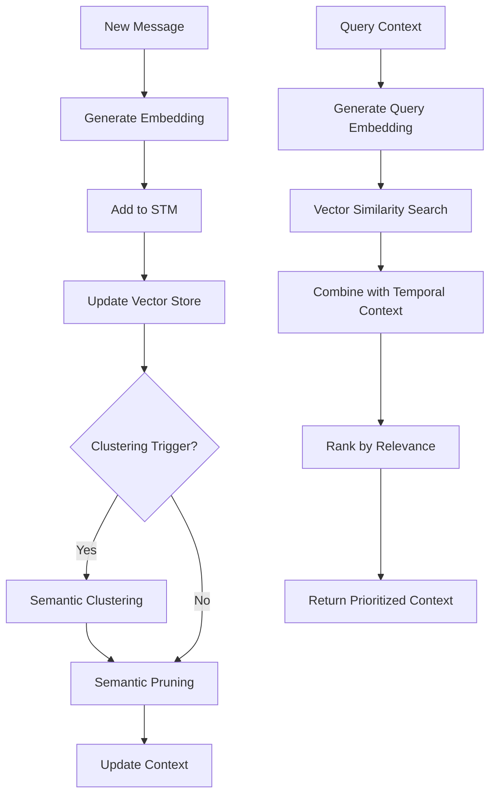

# Semantic Memory System Guide

## Overview

The Semantic Memory System is an advanced memory architecture that enhances the chatbot's ability to understand and recall conversations using semantic embeddings. Unlike traditional memory systems that rely on recency or simple keyword matching, semantic memory understands the **meaning** of conversations and can retrieve contextually relevant information even when different words are used.

## Key Features

### 🧠 **Semantic Understanding**
- Uses OpenAI embeddings to understand the meaning behind messages
- Finds related conversations even when different words are used
- Example: "I'm feeling sad" and "I'm depressed" are semantically similar

### 🔍 **Intelligent Context Retrieval**
- Combines recent messages (temporal context) with semantically similar messages
- Prioritizes context based on both recency and relevance
- Maintains conversation threads across time gaps

### 📊 **Semantic Clustering**
- Automatically groups related messages into semantic clusters
- Identifies conversation topics and themes
- Generates cluster summaries for efficient context compression

### ⚡ **Smart Memory Management**
- Promotes important messages to long-term memory based on semantic importance
- Uses semantic uniqueness as a factor in importance scoring
- Maintains vector stores for fast similarity search

## Architecture



## Configuration

### Environment Variables

```bash
# Enable semantic memory
USE_SEMANTIC_MEMORY=true

# Similarity threshold for semantic matching (0.0-1.0)
SEMANTIC_SIMILARITY_THRESHOLD=0.75

# Maximum number of semantic context messages to retrieve
MAX_SEMANTIC_CONTEXT=5

# How often to perform clustering (every N messages)
CLUSTERING_INTERVAL=5

# Weight given to semantic vs temporal relevance (0.0-1.0)
SEMANTIC_WEIGHT=0.6

# OpenAI embedding model to use
EMBEDDING_MODEL=text-embedding-3-small

# Embedding vector dimensions
EMBEDDING_DIMENSIONS=1536
```

### Memory Hierarchy

1. **Semantic Memory** (USE_SEMANTIC_MEMORY=true) - Advanced semantic understanding
2. **Redis Memory** (USE_REDIS_MEMORY=true) - Production-ready with persistence
3. **In-Memory** (default) - Simple development setup

## How It Works

### 1. Message Processing

When a new message arrives:

```javascript
// Generate semantic embedding
const embedding = await generateEmbedding(message);

// Create enhanced message object
const messageData = {
  id: uuid(),
  content: message,
  embedding: embedding,
  entities: extractEntities(message),
  sentiment: analyzeSentiment(message),
  topics: extractTopics(message),
  timestamp: Date.now()
};
```

### 2. Context Retrieval

For each response, the system:

```javascript
// Get recent messages (temporal context)
const recentMessages = getRecentMessages(sessionId, 5);

// Get semantically similar messages
const semanticMatches = await getSemanticContext(sessionId, currentMessage, 5);

// Combine and prioritize
const context = mergeContexts(recentMessages, semanticMatches);
```

### 3. Semantic Clustering

Every N messages, the system:

```javascript
// Group messages by semantic similarity
const clusters = performSemanticClustering(messages);

// Generate cluster summaries
await generateClusterSummaries(clusters);

// Update message cluster assignments
updateMessageClusters(messages, clusters);
```

### 4. Intelligent Pruning

When memory is full:

```javascript
// Calculate importance scores including semantic uniqueness
const scores = calculateSemanticImportance(messages);

// Keep recent + important messages
const toKeep = selectMessagesToKeep(messages, scores);

// Promote important messages to long-term memory
await promoteImportantMessages(toRemove, scores);
```

## Benefits

### 🎯 **Better Context Understanding**
- Retrieves relevant context even from earlier in the conversation
- Understands topic continuity across interruptions
- Maintains conversation threads naturally

### 💡 **Intelligent Memory Management**
- Only stores semantically important information long-term
- Compresses similar information into clusters
- Reduces memory footprint while improving relevance

### 🔄 **Adaptive Learning**
- Learns user communication patterns over time
- Builds semantic profiles of user interests
- Improves context retrieval with usage

### ⚡ **Performance Optimized**
- Fast vector similarity search
- Efficient clustering algorithms
- Configurable memory limits

## Usage Examples

### Basic Setup

```bash
# Enable semantic memory in .env
USE_SEMANTIC_MEMORY=true
OPENAI_API_KEY=your_api_key_here
```

### Advanced Configuration

```bash
# Fine-tune semantic parameters
SEMANTIC_SIMILARITY_THRESHOLD=0.8  # Higher = more strict matching
MAX_SEMANTIC_CONTEXT=3             # Fewer semantic matches
SEMANTIC_WEIGHT=0.7                # Prefer semantic over temporal
CLUSTERING_INTERVAL=10             # Cluster less frequently
```

### Development vs Production

```bash
# Development (lighter, faster)
USE_SEMANTIC_MEMORY=true
EMBEDDING_MODEL=text-embedding-3-small
EMBEDDING_DIMENSIONS=1536

# Production (higher quality)
USE_SEMANTIC_MEMORY=true
EMBEDDING_MODEL=text-embedding-3-large
EMBEDDING_DIMENSIONS=3072
```

## API Integration

### Memory Statistics

```javascript
GET /api/memory/stats

{
  "shortTerm": {
    "activeSessions": 5,
    "totalMessages": 150,
    "totalClusters": 12,
    "messagesWithEmbeddings": 145
  },
  "config": {
    "embeddingModel": "text-embedding-3-small",
    "similarityThreshold": 0.75,
    "semanticWeight": 0.6
  }
}
```

### Context Summary

```javascript
GET /api/memory/context/:sessionId

{
  "messageCount": 25,
  "semanticClusters": [
    {
      "id": "cluster_0",
      "messageCount": 8,
      "topics": ["work", "technology"],
      "summary": "Discussion about software development..."
    }
  ],
  "keyEntities": [...],
  "activeTopics": [...]
}
```

## Performance Considerations

### Memory Usage
- Each message stores a 1536-dimension embedding vector (~6KB)
- Vector stores are kept in memory for fast access
- Automatic cleanup of old sessions

### API Costs
- Uses OpenAI embedding API for each message
- text-embedding-3-small: ~$0.00002 per message
- Consider caching for repeated content

### Latency
- Embedding generation: ~100-200ms per message
- Vector similarity search: <10ms for typical session sizes
- Clustering: ~50ms for 20 messages

## Troubleshooting

### Common Issues

**High API Costs**
```bash
# Use smaller embedding model
EMBEDDING_MODEL=text-embedding-ada-002
EMBEDDING_DIMENSIONS=1536
```

**Slow Performance**
```bash
# Reduce context size
MAX_SEMANTIC_CONTEXT=3
SHORT_TERM_MEMORY_SIZE=15
```

**Poor Context Relevance**
```bash
# Adjust similarity threshold
SEMANTIC_SIMILARITY_THRESHOLD=0.8  # Higher = more strict
SEMANTIC_WEIGHT=0.7                # More semantic weight
```

### Health Check

```bash
curl http://localhost:3001/api/memory/health

{
  "healthy": true,
  "embeddingModel": "text-embedding-3-small",
  "activeSessions": 3,
  "vectorStores": 3
}
```

## Migration Guide

### From Basic Memory

1. Update environment variables:
```bash
USE_SEMANTIC_MEMORY=true
OPENAI_API_KEY=your_key_here
```

2. Restart the application
3. Existing sessions will gradually build semantic context

### From Redis Memory

1. Enable semantic memory:
```bash
USE_SEMANTIC_MEMORY=true
USE_REDIS_MEMORY=false  # Disable Redis
```

2. Note: Redis data won't be migrated automatically

## Best Practices

### Configuration
- Start with default settings and adjust based on usage
- Monitor API costs and adjust embedding model if needed
- Use higher similarity thresholds for focused conversations

### Development
- Use semantic memory in development to test context quality
- Monitor clustering behavior with debug logs
- Test with various conversation patterns

### Production
- Monitor memory usage and session cleanup
- Set up alerts for API cost spikes
- Consider using Redis for session persistence alongside semantic memory

## Future Enhancements

- **Persistent Vector Storage**: Integration with ChromaDB for vector persistence
- **Cross-Session Learning**: Semantic connections across different user sessions
- **Advanced Clustering**: Hierarchical clustering for better topic organization
- **Compression**: Semantic compression of old conversations
- **Analytics**: Detailed semantic analysis and insights

## Support

For issues or questions about the semantic memory system:

1. Check the health endpoint: `/api/memory/health`
2. Review logs for embedding generation errors
3. Verify OpenAI API key and quota
4. Test with simple conversations first

The semantic memory system represents a significant advancement in conversational AI memory, providing more natural and contextually aware interactions.
